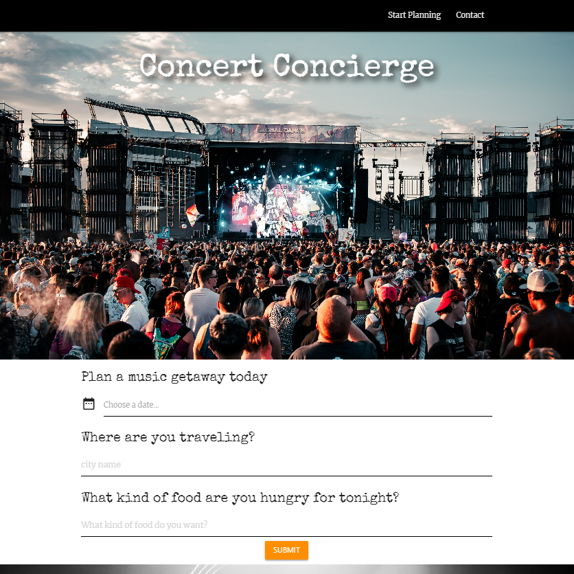

# Concert Concierge

## Description

Concert Concierge is an interactive application built for users that are looking to plan a getaway that revolves around local music and cuisine. The user will choose the date(s) they wish to travel, as well as the city and type of _food*_, then press submit. The 2 side-server API's(TicketMaster & Yelp!) will populate the shows in 'x' city on the left and your food options on the right. 

_*Currently we have the Yelp! API turned off due to limited free query submission._

## Languages & Technologies

- JavaScript
- HTML/CSS
- Materialize framework
- Moment.js
- JQuery
- TicketMaster API
- Yelp! API
- GH pages for deployment

## Contributing Guidelines

Contributions help our open source community to continue to evolve, and any contributions are greatly appreciated. If you have a suggestion that would improve this code please follow the directions below. I require that any and all changes adhere to the Code of Conduct outlined in the [Contributor Covenant](https://www.contributor-covenant.org/).

## Tests

At this time, no tests have been documented for this application.

## Mockup

## Deployed Link

[Click Here to view appliation.](https://lindsey-lansford.github.io/Concert_Concierge/)

## Questions

Please reach out with any questions you may have about this application.

* :octocat: GitHub: [@lindsey-lansford](https://github.com/lindsey-lansford)
* :envelope: Email: [lindsey.lansford@gmail.com](mailto:lindsey.lansford@gmail.com)